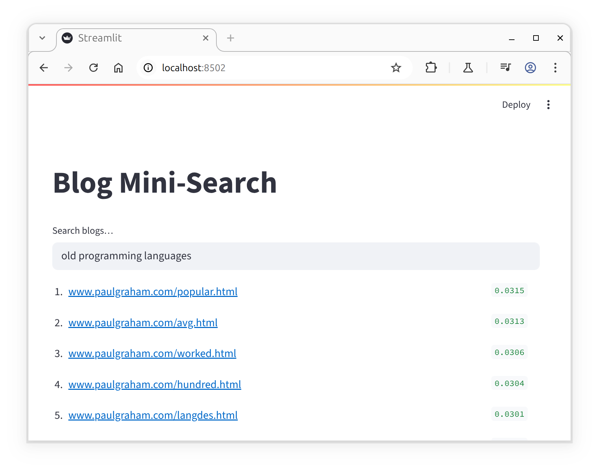
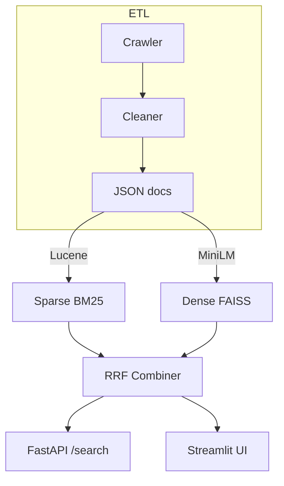

# Blog Mini-Search

A prototype that crawls blogs, builds a two‑stage hybrid retrieval stack (sparse BM25 + dense embeddings) and serves ranked results via REST API and Streamlit UI.

# 0 Prerequisites
- __Python 3.10 +__ (tested on 3.12)
- __Java JDK 21 +__ (needed by Lucene/Pyserini)
```bash
# Ubuntu / Debian
sudo apt‑get update && sudo apt‑get install -y openjdk-21-jdk
echo 'export JAVA_HOME=/usr/lib/jvm/java-21-openjdk-amd64' >> ~/.bashrc
echo 'export PATH=$JAVA_HOME/bin:$PATH' >> ~/.bashrc
source ~/.bashrc
```

# 1 Quick start

```bash
# create venv & install deps
python -m venv .venv && source .venv/bin/activate
pip install -r requirements.txt

# 1. crawl feeds listed in feeds.txt
python src/crawl.py

# 2. build indexes
python src/build_sparse.py  # BM25 / Lucene
python src/build_dense.py   # MiniLM / FAISS

# 3. run service & UI
uvicorn src.api:app --reload --port 8000   # REST /search
streamlit run src/app.py                   # UI on :8501
```

# 2 Methodology
## 2.1 Data Pipeline
| Step | Tool | Notes |
|------|------|-------|
| 1. Feed discovery | `feeds.txt` | One line = blog‑name + feed‑URL |
| 2. Crawling | Python `requests` + `feedparser` | Fetch each post, add UA header, retry on redirects |
| 3. Clean‑text extraction | `readability‑lxml` fallback --> `BeautifulSoup` | Strips boilerplate, returns body text |
| 4. Store | `data/json/*.json` | Persist `{id, title, body}` per document |

## 2.2 Sparse index (exact keyword)
__Engine__: Apache Lucene 9.9 via Pyserini.

__Analyzer__: English, Porter stemmer, stop‑words removed.

__Ranking__: BM25 with configurable (k1 = 0.9, b = 0.4).This configuration is fast on rare tokens ("SAFE", "ARR").

## 2.3 Dense index (semantic)

__Encoder__: sentence‑transformers/all‑MiniLM‑L6‑v2 → 384‑D vectors.

__Storage__: FAISS (IndexFlatIP, cosine via inner‑product), one vector per doc (title + body concat, 512‑token cap).Captures synonymy & paraphrase matches.
## 2.4 Fusion of sparse and dense results
Reciprocal‑Rank Fusion __RRF__ combines top‑N results from both lists (for a given $k$):

$$
\text{score}(d) = \sum_{L \in \{bm25, ANN\}} \frac{1}{k + r_L(d) + 1}
$$

# 3 System Architecture



# 4 Tech Stack

__Crawling__: Python requests, feedparser, readability

__Sparse search__: Pyserini/Lucene on‑disk index (altenatively Amazon OpenSearch, Elasticsearch SaaS)

__Vector search__: FAISS in‑process (altenatively Weaviate Cloud)

__Embeddings__: Sentence‑Transformers, open source, on CPU/GPU (alternatively OpenAI Embeddings)

__API__: FastAPI + Uvicorn (alternatively AWS Lambda)

__UI__: Streamlit (alternatively AWS Fargate)


# 5 Evaluation (to be completed)

- __Ground‑truth file__: store a set of relevant queries in `eval.json` (query relevant URLs).
- __Metrics__: obtain `nDCG@10` & `Recall@50`.

# 6 Future Roadmap
- Cross‑encoder rerank (BGE‑reranker or ColBERT‑v2) for tie‑breaking.
- Increasing the token length for embedding.
- Chunk‑level dense embeddings for long essays.
- Docker file.
- Monitoring and evaluation.

